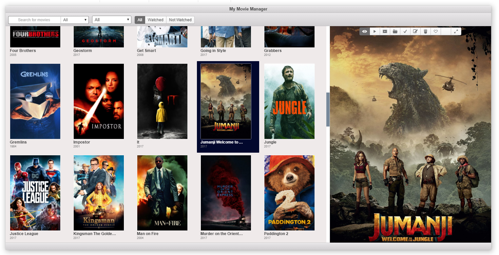

# My Movie Manager
Cross-platform Application for managing your movies and TV series.


##### [2019-06-28] This project is parked since a long time and probably won't be worked on any time in near future.



## Developing

Install git & Node JS, then

```
git clone https://github.com/sarathkcm/MyMovieManager.git

cd MyMovieManager

npm install

npm run build-all

npm start
```
If npm start doesn't work, run the command in NodeJS command prompt or install electron-prebuilt globally.
